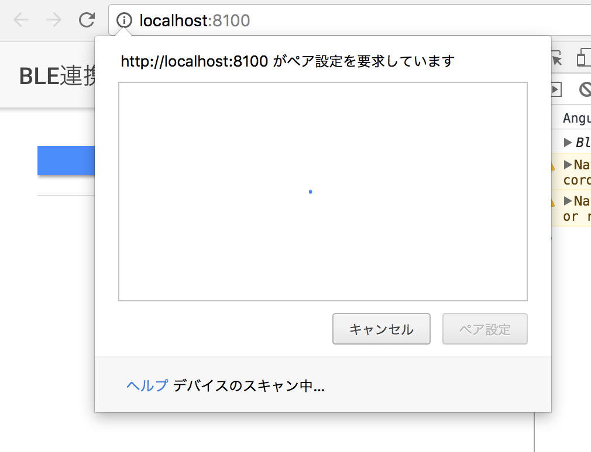
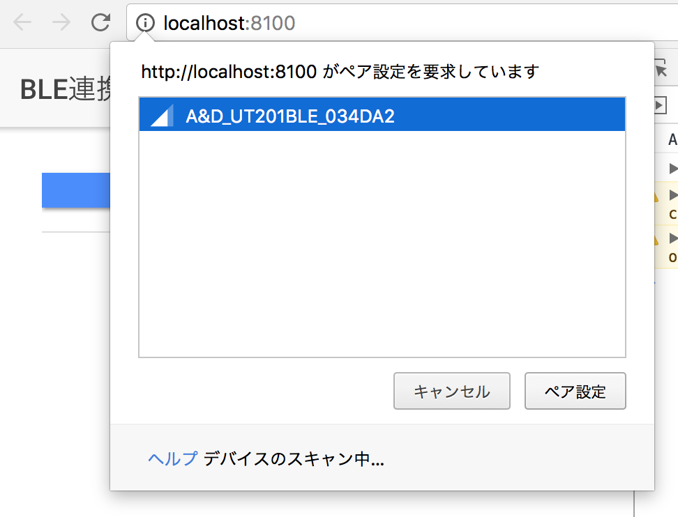
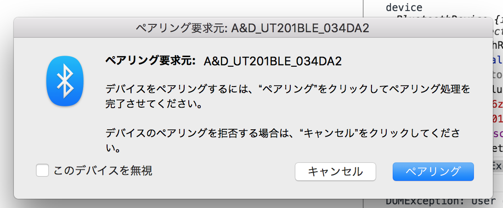
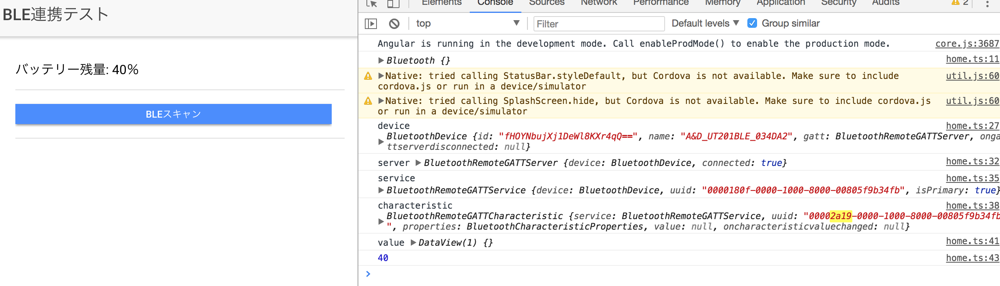

# Web BlueTooth API のサンプルアプリケーションです

現在Web BlueTooth APIはまだドラフト段階であるため今後仕様が大きく変わる可能性があります。

W3C Web Bluetooth: https://webbluetoothcg.github.io/web-bluetooth/

## 実際に試してみたこと

### BLE端末と接続してバッテリー残量を取得する

1. ボタンを押すとペアリング可能なBLEデバイスのスキャンが開始

2. ペアリング可能なBLEデバイスがあると端末名などが表示される

3. 端末を選択してペアリングを実施する

4. バッテリー残量を取得する処理を実行し画面に表示

